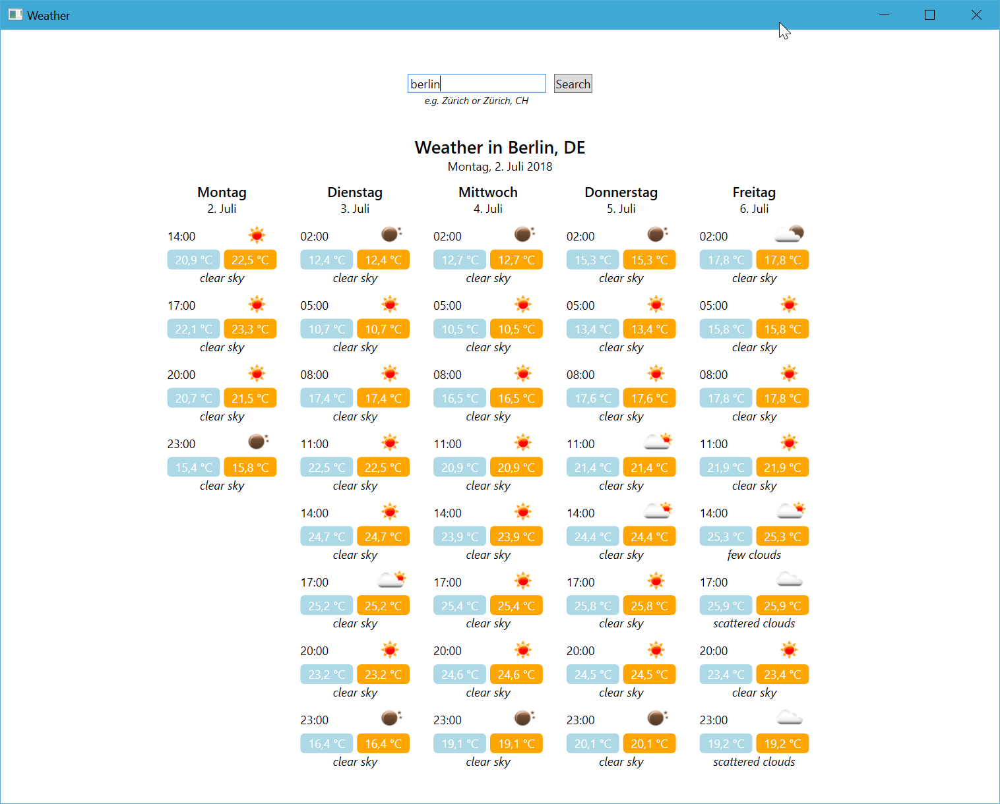

# weather-forecast
A single view WPF application which shows the weather forecast for the next 5 days using the [Open Weather Map API](https://openweathermap.org/forecast5).

# To-Do
- localization
- the minimum and maximum temperature for days other than today seem to be the same (a difference is expected)
- the application layout could be more dynamic depending on the screen size
